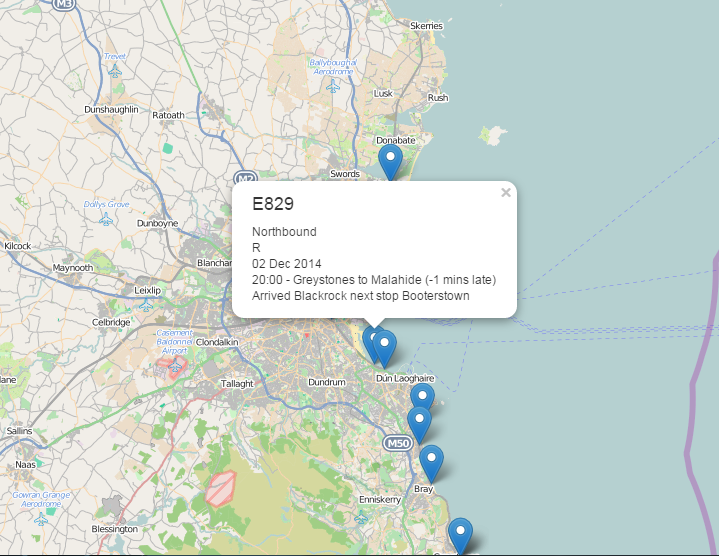

## Irish Commuter Rail (DART) information in Real-Time

### Why?

AngularJS works with JSON not XML. JSON is preferred to XML for RESTful API's. JSON takes less bandwidth to transmit, is simpler to understand visually and is far easier to deal with on the client as it works seamlessly with javascript.
[Geo JSON](http://geojson.org/) is a JSON format specifically designed for geographic applications.

### App Functionality

NodeJS server gets real time train data in XML format from the Irish Rail API for the [DART commuter rail](http://www.irishrail.ie/about-us/dart-commuter). The XML data is then converted to a javascript. String manipulation is performed to create an Object in the [Geo JSON format](http://geojson.org/geojson-spec.html). The Object is send via socket.io. Socket.io serialises the transmitted data as JSON. The client will receive the train data as Geo JSON.

The client renders a map in the browser with the help of [leafletJS](http://leafletjs.com/). [Leaflet-realtime](https://github.com/perliedman/leaflet-realtime) is used to work with the realtime data read from the server. 

### Main Technologies Used

- [NodeJS](http://nodejs.org/)
- [ExpressJS](http://expressjs.com/) 
- [AngularJS](https://angularjs.org/)
- [Socket.io](socket.io)
- [BT Ford's socket.io Angular Module](https://github.com/btford/angular-socket-io)
- [Simplified HTTP request client](https://github.com/request/request)
- [xml2js XML to JavaScript object converter](https://github.com/Leonidas-from-XIV/node-xml2js)
- [Geo JSON](http://geojson.org/)
- [LeafletJS](http://leafletjs.com/)
- [leaflet-realtime](https://github.com/perliedman/leaflet-realtime)

### Running the App

- clone the repository
- npm install
- bower install
- node server.js
- browse to _http://localhost:3000/_
- Enable browsers developer tools (e.g. turn on Firebug)
- Be patient
- Realtime DART train locations will appear on a map centered around connolly station
- Click on an icon for specific train info

## Screen Shots

		

Michael Cullen 2014
